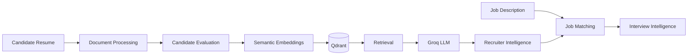
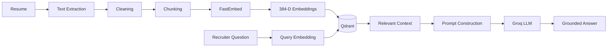
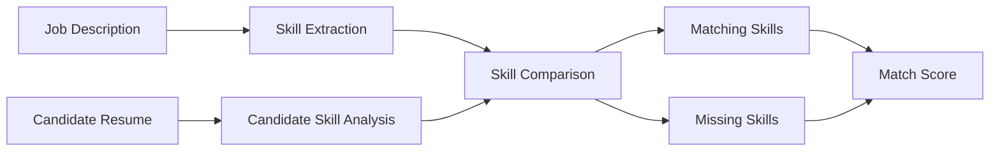
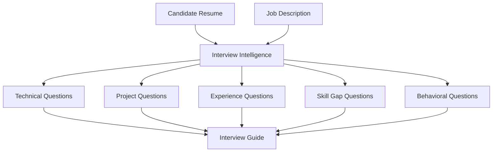
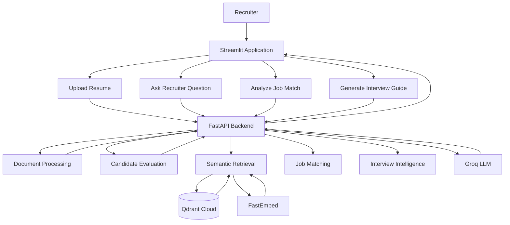
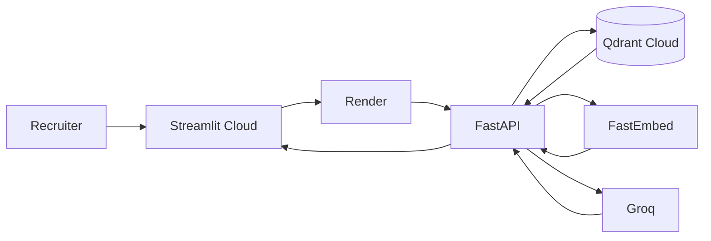

<div align="center">


<br/>

<a href="https://recruitrag-ai-szgzxyf5eum4c9lg4xtvxq.streamlit.app/">

</a>

<a href="https://recruitrag-ai-api.onrender.com/docs">

</a>

<a href="https://github.com/shubhamkardel-ai/RecruitRAG-AI">

</a>

<br/><br/>


<br/><br/>

**Transform resumes into searchable, explainable, recruiter-ready intelligence.**

</div>

---

# 🧠 What is RecruitRAG-AI?

RecruitRAG-AI is an **AI-powered recruitment intelligence platform** that helps recruiters understand candidates, search resume information using natural language, evaluate candidate fit, match candidates against job descriptions, and generate role-specific interview intelligence.

Instead of treating a resume as a static document, RecruitRAG-AI transforms it into a **searchable candidate knowledge base**.

### The platform combines

* 📄 Resume document intelligence
* 🧠 Retrieval-Augmented Generation
* 🎯 Deterministic candidate evaluation
* 🔎 Semantic vector retrieval
* 💬 Grounded recruiter Q&A
* 📊 Job description matching
* 🎤 AI interview intelligence

---

# ⚡ The Recruitment Intelligence Pipeline



---

# 🖥️ Product Preview

The platform provides a complete recruiter workflow through a Streamlit interface.


### Recruiter workflow

**Upload → Index → Evaluate → Ask → Match → Interview**

The interface provides live API connectivity, RAG status, AI assistant status, resume processing, recruiter analysis, and candidate decision capabilities.

---

# 🚀 Core Capabilities

| Capability                    | What it does                                                         |
| ----------------------------- | -------------------------------------------------------------------- |
| 📄 **Resume Intelligence**    | Processes PDF, DOCX, and TXT resumes                                 |
| 🧩 **Document Processing**    | Extracts, cleans, and intelligently chunks resume content            |
| 🎯 **Candidate Evaluation**   | Produces an explainable score out of 100                             |
| 🔎 **Semantic Retrieval**     | Retrieves relevant resume information using vector similarity        |
| 💬 **Recruiter Q&A**          | Answers natural-language questions using retrieved candidate context |
| 📊 **Job Matching**           | Compares candidate skills against a target job description           |
| 🎤 **Interview Intelligence** | Generates role-specific interview questions                          |
| ☁️ **Cloud Deployment**       | Runs across Streamlit Cloud, Render, Qdrant Cloud, and Groq          |

---

# 🧠 Retrieval-Augmented Generation

Traditional keyword search can fail when information is expressed differently.

For example, a recruiter may ask:

> **"Does this candidate have practical experience building APIs?"**

The relevant evidence might be distributed across projects, work experience, and technical descriptions.

RecruitRAG-AI uses **RAG** to retrieve relevant candidate information before asking the LLM to generate a response.

### RAG Flow



### Grounding Principles

The generation layer is designed to:

* use retrieved candidate context
* prioritize resume evidence
* avoid inventing candidate information
* answer only from available evidence
* indicate when requested information is unavailable

---

# 🎯 Candidate Evaluation

RecruitRAG-AI includes a deterministic candidate evaluation engine.

The candidate is evaluated across six dimensions.

| Evaluation Area         |  Weight |
| ----------------------- | ------: |
| Technical Skills        |      20 |
| Project Experience      |      20 |
| Professional Experience |      20 |
| Education               |      15 |
| Certifications          |      10 |
| Role Relevance          |      15 |
| **Total**               | **100** |

### Recommendation Logic

|      Score | Recommendation   |
| ---------: | ---------------- |
| **80–100** | 🟢 Strong Fit    |
|  **65–79** | 🔵 Potential Fit |
|  **50–64** | 🟡 Needs Review  |
|   **0–49** | 🔴 Weak Fit      |

The primary score is calculated deterministically so the evaluation remains **reproducible and explainable**.

---

# 📊 Candidate Evaluation — Production Result

The deployed application successfully evaluated a candidate with:

```text
Overall Candidate Score
98 / 100

Hiring Recommendation
Strong Fit
```


### Evaluation breakdown

```text
Technical Skills          20 / 20
Project Experience        20 / 20
Professional Experience   20 / 20
Education                 15 / 15
Certifications            10 / 10
Role Relevance            13 / 15

Total                     98 / 100
```

This provides recruiters with both the **overall decision** and the **reasoning structure behind the score**.

---

# 🔍 Recruiter Intelligence

Recruiters can ask natural-language questions about an indexed candidate.

Examples:

```text
What are the candidate's strongest technical skills?
```

```text
What AI/ML projects has the candidate built?
```

```text
Does the candidate have Python experience?
```

```text
What machine-learning experience is mentioned?
```

The system retrieves relevant resume chunks and uses them as context for the generated response.

---

# 📊 Job Description Matching

RecruitRAG-AI can compare an indexed candidate against a target job description.



### Matching provides

* Match percentage
* Matching skills
* Missing skills
* Candidate-job alignment

---

# 🎯 Job Match — Production Result

Example AI/ML Engineer job description:

```text
We are looking for an AI/ML Engineer with strong Python,
SQL, Pandas, NumPy, Scikit-learn and FastAPI skills.

The candidate should have experience building machine
learning projects, working with data, developing APIs
and deploying AI applications.
```

The system produced:

```text
Job Match Score
86%
```

### Matching Skills

`Python · SQL · Pandas · NumPy · Scikit-learn · Machine Learning`

### Missing Skill

`FastAPI`


This gives recruiters a quick way to identify **where the candidate aligns and where the skill gaps exist**.

---

# 🎤 AI Interview Intelligence

Once a candidate and target role are available, RecruitRAG-AI can generate a structured interview guide.



### Generated interview intelligence includes

* Technical questions
* Project-specific questions
* Experience questions
* Skill-gap questions
* Behavioral questions
* What-to-listen-for evaluation guidance

---

# 🎤 Interview Guide — Production Result

The platform generated a role-specific interview guide for an **AI/ML Engineer** position.


Example generated areas include:

```text
1. Technical Interview Questions

2. Project-Based Questions

3. Machine Learning Questions

4. Python / SQL Questions

5. Experience-Based Questions

6. Behavioral Questions
```

The guide can also provide interviewer guidance on **what to listen for**, helping turn generated questions into a more structured evaluation process.

---

# 🧠 AI Candidate Strengths Insight

RecruitRAG-AI can generate a structured candidate-strengths analysis from retrieved resume evidence.


The generated analysis can organize evidence into areas such as:

* Data Analysis & Visualization
* Machine Learning & Predictive Modeling
* Business Intelligence & Reporting
* Technical Toolset
* Certifications & Continuous Learning
* Professional Experience

The system also provides source/context references associated with the retrieved evidence.

---

# 🔄 Complete Recruiter Workflow



---

# ☁️ Production Architecture



### Deployment Stack

| Layer                | Technology               | Purpose                              |
| -------------------- | ------------------------ | ------------------------------------ |
| Frontend             | **Streamlit Cloud**      | Recruiter interface                  |
| Backend              | **FastAPI**              | API and application orchestration    |
| Hosting              | **Render**               | Production backend                   |
| Vector Database      | **Qdrant Cloud**         | Semantic retrieval                   |
| Embeddings           | **FastEmbed**            | Resume/query embeddings              |
| Model                | `BAAI/bge-small-en-v1.5` | 384-dimensional embeddings           |
| LLM                  | **Groq**                 | AI response generation               |
| Local Infrastructure | **Docker**               | Reproducible development environment |
| API Docs             | **FastAPI Swagger**      | Interactive API documentation        |

> **Deployment note:** The current Render backend uses the free tier, so the service can sleep after inactivity and require a cold start.

---

# 🏗️ Project Architecture

The application follows a modular architecture separating core responsibilities.

```text
RecruitRAG-AI/

app/
    api/
        routes/
            documents.py
            matching.py
            interview.py

    evaluation/
        evaluator.py

    generation/
        llm.py
        prompts.py
        response_generator.py

    ingestion/
        pipeline.py

    interview/
        job_interviewer.py
        interview_service.py

    matching/
        job_matcher.py
        matching_service.py

    retrieval/
        embeddings.py
        retriever.py
        vector_store.py

    services/
        document_service.py

    rag_pipeline.py

data/
    uploads/

Dockerfile
docker-compose.yml
main.py
streamlit_app.py
requirements.txt
.env.example
.gitignore
README.md
```

### Design Separation

The system separates:

**Ingestion**

→ document extraction
→ cleaning
→ chunking

**Evaluation**

→ candidate scoring
→ recommendation

**Retrieval**

→ embeddings
→ vector search
→ relevant context

**Generation**

→ prompt construction
→ LLM response

**Matching**

→ job skill extraction
→ candidate comparison
→ skill gaps

**Interview**

→ role-specific questions
→ evaluation guidance

---

# 🔌 API

| Method | Endpoint              | Purpose                                 |
| ------ | --------------------- | --------------------------------------- |
| `POST` | `/documents/upload`   | Upload and index resume                 |
| `POST` | `/chat/ask`           | Ask grounded candidate questions        |
| `POST` | `/matching/match`     | Match candidate against job description |
| `POST` | `/interview/generate` | Generate interview guide                |
| `GET`  | `/docs`               | Interactive Swagger documentation       |

### Example

```json
{
  "job_description": "We are looking for an AI/ML Engineer with strong Python, SQL, Machine Learning, Pandas, NumPy, Scikit-learn and FastAPI skills."
}
```

---

# 🧪 Production Validation

The deployed platform has been tested across the major recruitment workflows.

| Workflow               | Result                 |
| ---------------------- | ---------------------- |
| Resume upload          | ✅ Passed               |
| PDF extraction         | ✅ Passed               |
| Resume chunking        | ✅ Passed               |
| Candidate evaluation   | ✅ 98/100               |
| Hiring recommendation  | ✅ Strong Fit           |
| Vector indexing        | ✅ 3 chunks / 3 vectors |
| RAG Q&A                | ✅ Passed               |
| Job matching           | ✅ 86%                  |
| Interview generation   | ✅ Passed               |
| Streamlit → Render API | ✅ Passed               |
| Qdrant Cloud retrieval | ✅ Passed               |

---

# 🛠️ Technology Stack

<div align="center">


<br/><br/>


</div>

---

# 💻 Run Locally

## 1. Clone the repository

```bash
git clone https://github.com/shubhamkardel-ai/RecruitRAG-AI.git
cd RecruitRAG-AI
```

## 2. Create a virtual environment

```bash
python -m venv .venv
```

## 3. Activate the environment

### Windows PowerShell

```powershell
.venv\Scripts\Activate.ps1
```

## 4. Install dependencies

```bash
pip install -r requirements.txt
```

## 5. Configure environment variables

Create `.env` using `.env.example`.

```env
GROQ_API_KEY=your_groq_api_key
LLM_MODEL=openai/gpt-oss-120b

QDRANT_URL=
QDRANT_API_KEY=
```

> Never commit real API keys or secrets to GitHub.

## 6. Start Qdrant

```bash
docker compose up -d qdrant
```

## 7. Start FastAPI

```bash
uvicorn main:app --reload --port 8000
```

## 8. Start Streamlit

Open another terminal:

```bash
streamlit run streamlit_app.py
```

### Local Application

```text
http://localhost:8501
```

### Local Swagger

```text
http://localhost:8000/docs
```

---

# 🐳 Docker

Run the complete local environment with:

```bash
docker compose up --build
```

Docker provides a reproducible environment for the application infrastructure.

---

# 🔐 Security

RecruitRAG-AI follows environment-based secret management.

* API keys are stored in environment variables.
* `.env` is excluded from Git.
* `.env.example` contains placeholders only.
* Production credentials belong in deployment environment variables.
* Secrets must never be committed to GitHub.
* Exposed credentials should be revoked and rotated immediately.

---

# 🧠 Engineering Principles

### Grounded Generation

The LLM receives retrieved candidate context before generating recruiter-facing answers.

### Deterministic Candidate Evaluation

The primary candidate score follows a fixed scoring structure rather than relying entirely on free-form LLM judgment.

### Modular AI Architecture

Retrieval, evaluation, generation, matching, and interview intelligence are separated into independent modules.

### API-First Backend

The core recruitment intelligence is exposed through FastAPI and consumed by the Streamlit frontend.

### Production-Oriented Development

The system supports local Docker infrastructure as well as cloud deployment.

---

# 🔮 Roadmap

Planned future improvements:

* Multi-resume candidate comparison
* Recruiter ranking and shortlist generation
* Advanced semantic job matching
* Candidate skill-gap analytics
* Interview answer evaluation
* Recruiter conversation memory
* Document deduplication and versioning
* Authentication and role-based access control
* Observability and monitoring
* RAG evaluation datasets
* Automated retrieval and generation benchmarks

---

# 🌐 Live Project

<div align="center">

## Try RecruitRAG-AI

<a href="https://recruitrag-ai-szgzxyf5eum4c9lg4xtvxq.streamlit.app/">

</a>

<br/><br/>

<a href="https://recruitrag-ai-api.onrender.com/docs">

</a>

<a href="https://github.com/shubhamkardel-ai/RecruitRAG-AI">

</a>

</div>

---

# 👨‍💻 Author

<div align="center">

### Shubham Kardel

**Aspiring AI/ML Engineer · Python Developer · GenAI Builder**

<br/>

<a href="https://github.com/shubhamkardel-ai">

</a>

<a href="https://www.linkedin.com/in/shubham-kardel-303356312/">

</a>

<br/><br/>


</div>

---

<div align="center">

**RecruitRAG-AI**

*From candidate documents to grounded recruitment intelligence.*

</div>
